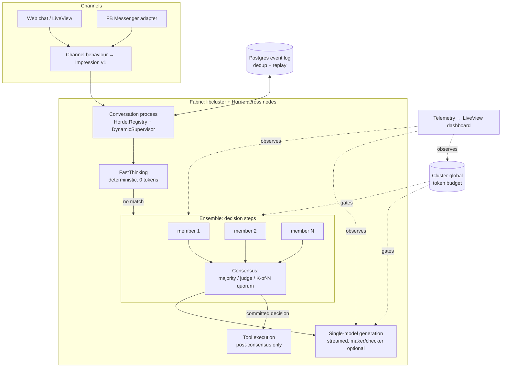

# ♻️ Rebuild Virtuoso as a BEAM AI-Agent Orchestration Framework

## Overview

Virtuoso (github.com/justuseapen/virtuoso, v0.0.29) is a 2018-era Phoenix chatbot-orchestration framework. This plan rebuilds it as a modern Elixir/OTP **AI agent orchestration framework** implementing the two concepts Brian Roemmele announced on 2026-07-16 (x.com/BrianRoemmele/status/2077741960614539392):

1. **Actor-based parallel consensus** — many lightweight BEAM processes run LLM calls concurrently; their outputs are aggregated by consensus/judging instead of a single serial call chain.
2. **Distributed compute fabric** — a multi-node BEAM cluster with automatic failure recovery and horizontal scaling of conversations/agents.

Roemmele published no repo (announcement only), so "his model" here means these two architectural ideas — which are, usefully, standard OTP patterns. Virtuoso's existing skeleton (per-conversation GenServers, Registry, FastThinking → SlowThinking → Routine pipeline) is a natural host: we keep the cognitive model and swap the 2018 NLP guts (Wit.ai/Watson intent classification) for LLM ensembles.

> ⚠️ **Repo damage discovered during research:** every file in `~/Dropbox/code/virtuoso/` (including `.git` internals) is a zero-byte Dropbox online-only placeholder (`com.dropbox.placeholder` xattr) that no longer hydrates. The working copy is unrecoverable locally. **GitHub has the full source** (`justuseapen/virtuoso`, default branch `master`, HEAD `1ec3ca1`). Phase 0 recovers from GitHub.

## Problem Statement

- The local checkout is hollow (Dropbox placeholder damage) and the codebase is frozen in 2018: Elixir ~1.4, Phoenix 1.4, `Supervisor.Spec`/`worker/2` (removed in modern OTP), compile-time `Application.get_env`, Poison, Brunch assets. It will not compile on any supported Elixir.
- The "intelligence" layer is pre-LLM: Wit.ai/Watson intent classification driving routine dispatch. Everything interesting about 2026 agents (LLM reasoning, tool use, verification, ensembles) is absent.
- Orchestration is one serial pipeline per message. There is no verification of outputs (no maker/checker), no parallelism in reasoning, no multi-node story, and conversation state dies with its process.
- Known security debt: `String.to_atom` on intent strings (atom-table exhaustion DoS), no stated webhook signature verification, unauthenticated admin dashboard.

## Proposed Solution

Rebuild as an umbrella-free library + optional Phoenix host app, keeping Virtuoso's names and cognitive shape:

| Legacy concept | Rebuild |
|---|---|
| `%Impression{}` envelope | Kept — channel-neutral message envelope (+ media, +metadata, versioned struct) |
| FastThinking (pattern-match fast path) | Kept as-is philosophically: deterministic, zero-token fast paths |
| SlowThinking (Wit/Watson NLP) | LLM reasoning step (Claude API primary: `claude-fable-5`, `claude-sonnet-5`, `claude-haiku-4-5`), behaviour-based client so tests never hit the network |
| Routine dispatch via `String.to_atom` | Explicit routine/tool registry (compile-time map; no dynamic atom creation) |
| Conversation GenServer + Registry (single node, in-memory) | Persisted conversation processes, cluster-wide via fabric layer |
| Wit/Watson clients | `Virtuoso.LLM` behaviour + adapters (Anthropic first; others later) |
| FB Messenger (hardwired) | `Virtuoso.Channel` behaviour; web chat (Phoenix Channels/LiveView) first-class, FB Messenger demoted to one adapter |
| — | **NEW `Virtuoso.Ensemble`** — parallel consensus (Roemmele concept a) |
| — | **NEW `Virtuoso.Fabric`** — distributed compute fabric (Roemmele concept b) |
| Admin LiveView dashboard | Telemetry-driven LiveView dashboard: live ensemble votes, dissent, latency, token cost |

### Key design decisions (resolved up front — these shaped the whole plan)

1. **What is a vote?** Consensus applies only to **structured/categorical outputs** (routing decisions, tool selection, JSON-schema extraction, pass/fail verdicts) where equivalence = canonicalized exact match. Free-form generative replies are **never majority-voted**; they use single-model generation, optionally maker/checker-verified. This keeps the flagship feature where consensus is actually sound.
2. **Ensemble members are pure.** No tool side effects inside members. Tools execute only *after* consensus commits a decision. (N members must never mean N side effects.)
3. **Persistence precedes fabric.** Horde failover is meaningless if state dies with the process. Conversations persist as an append-only Postgres event log (dedup key = channel message ID), with ETS as hot cache. Recovery = rehydrate from log. Ordering/exactly-once guarantees are defined by the log, not the process.
4. **Token budgeting is cluster-global, not per-node.** Anthropic limits are per-API-key, so the budget is one named token-bucket process (fabric-supervised, itself failover-capable) + per-conversation caps + a kill switch. Budgeting is an Ensemble safety property, not a Fabric afterthought.
5. **Streaming vs consensus:** streaming to the user comes from the single generation model. Ensemble consensus runs on the fast, structured *decision* steps (routing/verification), which are short — so chat UX keeps streamed tokens and p95 latency stays sane.
6. **Maker/checker loops are bounded**: max 2 checker rejections → escalate one model tier once → fall back to a defined "best effort + flagged" response. Never unbounded regeneration.

## Technical Approach

### Architecture



### Module layout (target)

```
lib/virtuoso/
  impression.ex            # versioned envelope (v1), media + metadata
  channel.ex               # behaviour: init/1, translate_in/1, send_out/2, verify_webhook/1
  channels/web_chat.ex     #   Phoenix Channels/LiveView adapter (session-based identity)
  channels/fb_messenger.ex #   legacy adapter, signature verification required
  conversation.ex          # process; state from event log; queue-per-conversation ordering
  conversation/log.ex      # Postgres append-only log, dedup by channel message id
  llm.ex                   # behaviour: complete/2, stream/2 (mocked in tests)
  llm/anthropic.ex         # Req-based client; models: fable-5 / sonnet-5 / haiku-4-5
  ensemble.ex              # fan-out via Task.Supervisor (async_stream_nolink), K-of-N quorum
  ensemble/strategy/*.ex   # majority.ex, judge.ex, quorum.ex (behaviour)
  ensemble/checker.ex      # maker/checker with bounded retry + escalation
  budget.ex                # cluster-global token bucket + per-conversation caps + kill switch
  fabric.ex                # libcluster topology config, single-node no-op default
  fabric/supervisor.ex     # Horde.Registry + Horde.DynamicSupervisor + handoff
  routine.ex               # explicit registry (compile-time map — no String.to_atom)
  thinking/fast.ex         # behaviour (per-bot pattern matches)
  thinking/slow.ex         # LLM step: routing via Ensemble, generation via single model
```

### Implementation Phases

#### Phase 0: Recovery & scaffold (small)
- [x] Clone `justuseapen/virtuoso` from GitHub to a **non-placeholder location**; decide Dropbox strategy (recommend: keep repo outside Dropbox's damaged folder or replace the placeholder dir wholesale; verify with `xattr -l` that new files aren't placeholder-tracked)
      → **Done:** placeholder dir replaced wholesale. Verified: 99 files with content, 0 zero-byte, no `com.dropbox.placeholder` xattr, `.git` functional at `1ec3ca1`. Repo remains under Dropbox — re-exposed to eviction; pin "Make Available Offline" in the Dropbox UI to prevent recurrence.
- [x] Tag `v0.0.29-legacy` at current HEAD; create branch `rebuild/beam-orchestration`
- [ ] Fresh `mix new` scaffold on Elixir 1.15.6-otp-26 (`.tool-versions` + `git add -f` — known gotcha), Phoenix 1.7, Bandit, Req, Jason; port `%Impression{}` and FastThinking pattern-match style from legacy as the seed
- **Success:** `mix compile --warnings-as-errors`, `mix test`, dialyzer clean on 1.15.6-otp-26

#### Phase 1: Modern core — LLM SlowThinking + persistence (the useful single-node framework)
- [x] `Virtuoso.LLM` behaviour + Anthropic adapter (Req; streaming + non-streaming; typed errors for 429/529/timeout)
      → **Done:** behaviour (`complete/2`, `stream/3`), `LLM.Error` typed errors, offline `LLM.Mock`, Anthropic adapter on Req with SSE parsing + typed error mapping. 31 tests, dialyzer/credo/warnings-as-errors clean. Model IDs left open (adapter is model-agnostic); default `claude-opus-4-8` per current API docs. Streaming buffers the full response in v1 (see note in `anthropic.ex`) — incremental `:into` deferred to when generation is wired to the web-chat channel.
- [x] Conversation process + Postgres event log: append per message, dedup by channel message ID, rehydrate on start, per-conversation FIFO queue (message #2 waits for #1), history truncation/summarization policy for context window
      → **Done:** append-only `Conversation.Log` (unique dedup index, replay), `Conversation` GenServer (Registry + DynamicSupervisor, rehydrates from log on start, FIFO via serial mailbox), crash recovery verified (kill → next deliver rebuilds from log). Fixed a real race in `ensure_started/1` (caller racing a crash hit `:noproc`) with a liveness check + single rehydrating retry. History truncation policy still a stub (deferred to SlowThinking context-window work).
- [x] Explicit routine registry replacing `String.to_atom` dispatch
      → **Done:** `Virtuoso.Routine` — string-keyed map lookup, `fetch/2` returns `:error` (never creates an atom) for unknown/hostile/non-string names, `dispatch/4` runs the routine. Atom-exhaustion DoS closed; test asserts the evil string never becomes an atom.
- [ ] Channel behaviour + web-chat adapter (Phoenix Channels; session identity); FB adapter ported with webhook signature verification + idempotent delivery (at-least-once → exactly-one reply)
- [x] `Virtuoso.Budget` v1: per-conversation and global daily caps, kill switch, defined refusal fallback
      → **Done:** named GenServer (cluster-global singleton in the app tree; Phase 3 makes it fabric-supervised). `check/2` gates before each call; per-conversation + global daily caps; `kill_switch/1`; `with_budget/3` gates → runs → records usage → returns `{:error, reason, refusal_message()}` when over budget so callers can't forget to record. Defaults `:infinity` (opt-in caps).
- [x] Telemetry events (documented as public API) for every LLM call: model, tokens, latency, outcome
      → **Done:** `Virtuoso.LLM.complete/2` and `stream/3` (the single choke point every framework LLM call passes through) emit `[:virtuoso, :llm, :complete|:stream, :start|:stop|:exception]` — start `system_time`, stop `duration` + `model`/`outcome`/`usage`/`error_reason`, exception path re-raises after emitting. Event names documented in the module as public API.
- **Success:** end-to-end chat via web channel with streamed replies; replaying a duplicate webhook yields exactly one reply and one billing event; suite passes fully offline via LLM mock

#### Phase 2: Ensemble — actor-based parallel consensus (Roemmele concept a)
- [ ] `Ensemble.run/3`: fan out N members (model/temperature/prompt variants) via `Task.Supervisor.async_stream_nolink`; K-of-N quorum with partial-failure policy (429/timeout members dropped; below quorum → single-model fallback)
- [ ] Strategies as behaviour: `Majority` (canonicalized exact match on structured output), `Quorum` (first K agreeing), `Judge` (judge model with structurally separated inputs — member outputs fenced as data to resist prompt injection; judge failure → majority fallback)
- [ ] Maker/checker (`Ensemble.Checker`): bounded (2 rejections → one tier escalation → flagged best-effort)
- [ ] Wire into SlowThinking: routing/tool-selection decisions go through Ensemble; generation stays single-model streamed
- [ ] Ensemble config surface: per-bot defaults, per-routine overrides (`ensemble: [n: 3, strategy: :majority, models: [...]]`)
- [ ] Dashboard v1: live ensemble runs — votes, dissent, latency, cost per decision
- [ ] **Eval harness**: scripted task set proving N-way consensus beats single-call on routing/extraction accuracy — the flagship feature must justify its token multiplier
- **Success:** consensus strategies covered by property/unit tests incl. tie, partial failure, judge failure; p95 user-visible latency under ensemble < 8s; eval shows measurable accuracy gain

#### Phase 3: Fabric — distributed compute fabric (Roemmele concept b)
- [ ] **Spike first (timeboxed):** validate Horde registry consistency under netsplit on 3 local nodes; if unacceptable, fall back to `:global` + takeover or Postgres-advisory-lock ownership (decision gate — Horde is the highest-uncertainty dependency)
- [ ] libcluster topology (gossip for dev, DNS for Fly.io); **single-node no-op default** so library consumers need zero cluster config
- [ ] Conversation processes under Horde.Registry + Horde.DynamicSupervisor; handoff = stop → rehydrate from event log on new node (log is source of truth, so split-brain double-send is prevented by dedup on the *outbound* side: send-intent recorded in log before channel send)
- [ ] Netsplit conflict resolution: on registry merge, loser process terminates without flushing sends; in-flight LLM tasks abandoned (cost accepted, logged)
- [ ] Budget process made fabric-supervised singleton (handoff-capable)
- [ ] Rolling-deploy policy: versioned `%Impression{}`/state structs + drain-before-upgrade documented
- **Success:** kill -9 a node mid-conversation → conversation resumes on another node ≤ 5s with at most the in-flight message lost; 3-node partition/heal drill produces no duplicate outbound sends; suite still passes single-node with no cluster config

#### Phase 4: Developer experience & polish
- [ ] Generators updated: `virtuoso.gen.bot` (agent + FastThinking + prompts), `virtuoso.gen.routine`, `virtuoso.gen.tool`
- [ ] Prompt/agent definitions as files scaffolded by generators (not inline strings)
- [ ] Dashboard auth (host-app-provided plug), PII policy: transcripts redacted in telemetry/logs
- [ ] README + hexdocs rewrite; publish `0.1.0` to Hex
- **Success:** `mix virtuoso.gen.bot Demo` produces a compiling, chatting bot in < 5 min from a fresh app

## Alternative Approaches Considered

- **Wait for Roemmele's actual release and port it** — rejected: nothing published yet, and his described primitives are standard OTP; no reason to block.
- **Majority-vote free-form chat replies** — rejected (see decision 1): unsound equivalence, multiplies cost/latency on the weakest use case. Ensemble scoped to structured decisions.
- **Ecto-less durability (ETS + DETS/Mnesia)** — rejected: ETS dies with the node; Mnesia split-brain healing is worse than the problem. Postgres is already in the stack.
- **Build on an existing Elixir LLM framework (e.g. LangChain-Elixir)** — rejected for core (framework *is* the product; the ensemble/fabric layers are the point), but the Anthropic adapter may borrow from it.
- **Greenfield repo instead of rebuild-in-place** — partially adopted: fresh scaffold (Phase 0) inside the existing repo history, keeping the name, stars, and Hex package lineage.

## System-Wide Impact

- **Interaction graph:** webhook/channel → dedup check (log) → conversation queue → FastThinking → [Ensemble decision → tools] → generation → send-intent logged → channel send → telemetry. Every LLM call passes the Budget gate; budget refusal short-circuits to a defined fallback response.
- **Error propagation:** typed LLM errors (rate-limit/overload/timeout) are consumed *inside* Ensemble (member drop / quorum fallback) and never crash the conversation process; channel send failures retry with backoff, bounded, then log-and-surface on dashboard. Supervisor restarts rehydrate from the event log — crash mid-ensemble abandons in-flight tasks (cost accepted, telemetry-counted) rather than re-running them (no double side effects).
- **State lifecycle risks:** the append-only log + outbound send-intent record is the invariant that prevents both lost conversations and duplicate sends (incl. netsplit heal). Partial failure window = messages after last append; per-message append makes that window one message.
- **API surface parity:** `Virtuoso.Channel`, `Virtuoso.LLM`, `Ensemble.Strategy`, telemetry event names, and generator output are all public API — versioned and documented from 0.1.0.
- **Integration test scenarios (beyond unit mocks):** duplicate webhook replay; node kill mid-conversation; 3-node partition/heal; budget exhaustion mid-conversation; two rapid messages from one user (queue ordering); checker infinite-rejection input.

## Acceptance Criteria

### Functional
- [ ] End-to-end chat on web channel + FB adapter, streamed generation
- [ ] Ensemble consensus on routing/extraction with majority/quorum/judge strategies; documented config surface
- [ ] Maker/checker bounded verification loop
- [ ] Multi-node failover per Phase 3 success criteria; clean single-node degradation

### Non-functional
- [ ] p95 latency < 8s under default ensemble config; streamed first token < 2s for generation
- [ ] Enforced, tested cost ceilings (per-message, per-conversation, global daily) with kill switch
- [ ] Exactly-one reply per inbound message under webhook retries and netsplit heal
- [ ] No dynamic atom creation from external input; webhook signatures verified; dashboard authenticated; transcripts redacted from logs

### Quality gates
- [ ] `mix test` fully offline (LLM behaviour mocked); dialyzer + credo clean; `--warnings-as-errors`
- [ ] Chaos drills scripted (node kill, partition/heal) and documented
- [ ] Eval harness demonstrates ensemble accuracy gain over single-call baseline

## Dependencies & Risks

| Risk | Mitigation |
|---|---|
| **Cost blowout is structural** (N members × judge × checker × retries) | Budget subsystem is Phase 1, not an afterthought; eval harness proves value before defaults enable ensembles |
| **Horde maturity** (registry inconsistency windows, low maintenance) | Timeboxed Phase 3 spike with explicit fallback designs (`:global` takeover / Postgres advisory locks) |
| **Consensus-for-chat is the wrong shape** | Scoped to structured decisions by design decision 1 |
| **Scope vs solo dev + AI agents** | Phases 1–3 independently shippable; Phase 1 alone is already a useful modern framework; each phase is a Ralph-able story set |
| **Dropbox placeholder damage recurs** | Rebuild lives outside the damaged placeholder tree (or in a verified-hydrated dir); Phase 0 verifies with `xattr` |
| Elixir env friction (asdf global 1.14) | `.tool-versions` committed via `git add -f`; documented in README (repeat of VibeStream lesson) |
| Prompt injection steering the judge | Judge inputs structurally fenced; member outputs treated as data; adversarial tests in Phase 2 |

## Sources & References

### Internal
- Legacy source (recovered): `github.com/justuseapen/virtuoso` @ `1ec3ca1` — key files read: `lib/virtuoso/conversation.ex`, `lib/virtuoso/executive.ex`, `lib/memento_mori/{fast_thinking,slow_thinking,routine}.ex`, `lib/virtuoso/{bot,message,translation,impression}.ex`, `mix.exs`
- Local placeholder damage evidence: `~/Dropbox/code/virtuoso/` — all files 0 bytes with `com.dropbox.placeholder` xattr; `.git` hollow
- Related prior art in your stack: VibeStream (Membrane/Phoenix, single-node PubSub lesson), Ralph loop (phases → prd.json stories)

### External
- Brian Roemmele announcement (2026-07-16): x.com/BrianRoemmele/status/2077741960614539392 — no repo published as of 2026-07-17; concepts only
- libcluster, Horde hexdocs; Anthropic API docs (models: `claude-fable-5`, `claude-sonnet-5`, `claude-haiku-4-5-20251001`)

### Process
- SpecFlow analysis (this session) drove: vote-equivalence decision, pure-members rule, persistence-before-fabric ordering, cluster-global budgeting, bounded checker loops, and the chaos-drill acceptance criteria
